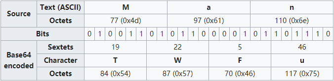
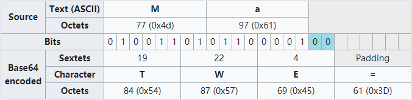
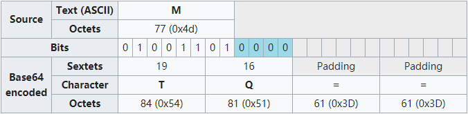
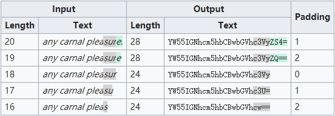

<https://en.wikipedia.org/wiki/Base64>

## Char Set

- 64 base: `a-z`, `A-Z`, `+`, `/`
- padding: `=`

## Encoding

Base64 encoding would turn each 3 Bytes group ($3*8=24$) to 4 Bytes ($4*6=24$), where 6 bits = 2**6 = 64.

## Example

